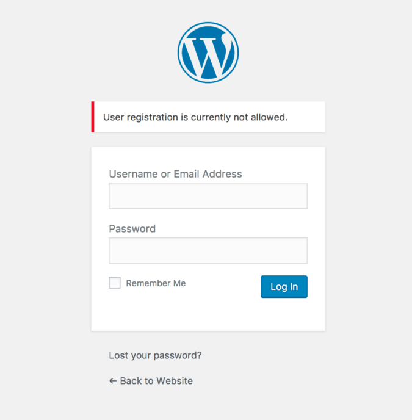
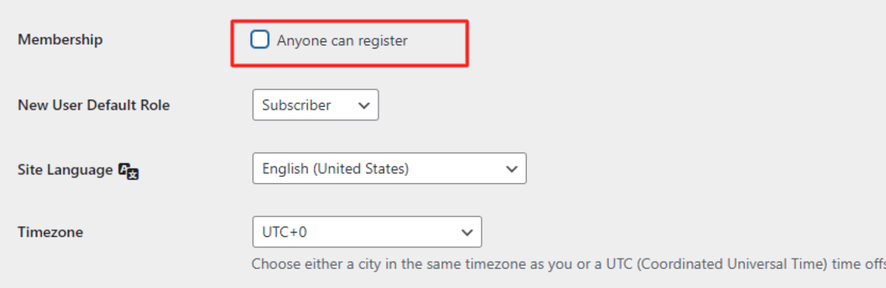
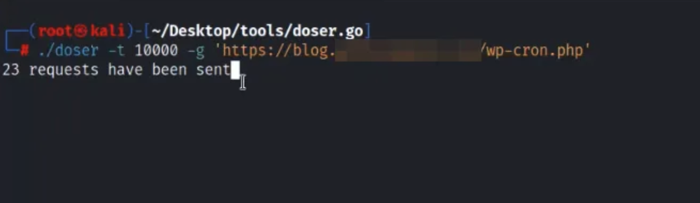
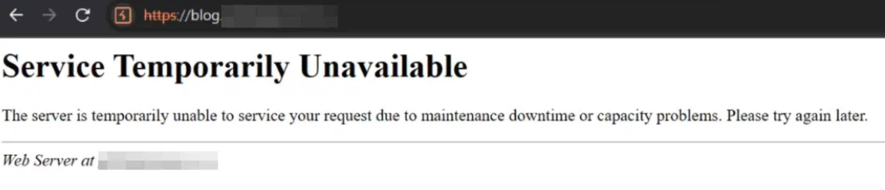
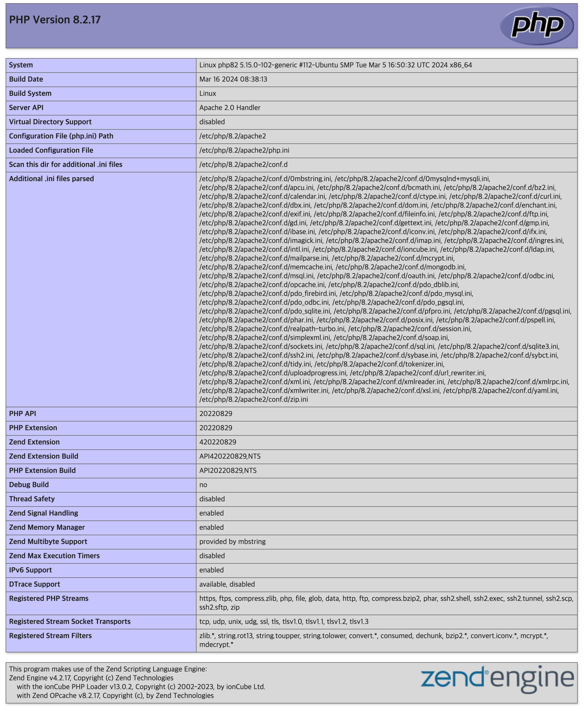

# Setup WordPress With Security Best Practice
[](https://hits.seeyoufarm.com)

This document is written with the purpose of being suitable for web applications developed using WordPress, where there is no interaction with users. 
Typically, it applies to corporate brand pages, various static views, recruitment pages, and the like.

For websites where users register (sign up) and freely use the site, such as open communities, some items in this document may not be applicable. Please keep this in mind as you read.

It does not encompass all the content necessary for securing WordPress. However, it is written to a level where it includes general but detailed information, allowing for security risk assessments and vulnerability responses based on the guide.
***

## Table of Contents
- [1. Ensure that the Default WordPress Admin Username has been Changed](#1-ensure-that-the-default-wordpress-admin-username-has-been-changed)
- [2. Ensure User Roles and Permissions in WordPress are Properly Managed](#2-ensure-user-roles-and-permissions-in-wordpress-are-properly-managed)
- [3. Ensure User Registration is Disabled](#3-ensure-user-registration-is-disabled)
- [4. Ensure the Plugin File Editor is Disabled](#4-ensure-the-plugin-file-editor-is-disabled)
- [5. Ensure Unused, Unnecessary Plugins are Deactivated](#5-ensure-unused-unnecessary-plugins-are-deactivated)
- [6. Ensure WordPress is Configured to Use HTTPS Only, Including the WordPress Admin](#6-ensure-wordpress-is-configured-to-use-https-only-including-the-wordpress-admin)
- [7. Ensure IP Access Restrictions (ACL) are Applied](#7-ensure-ip-access-restrictions-acl-are-applied)
  * [7.1. Ensure that IP access restrictions are applied to the WordPress admin.](#71-ensure-that-ip-access-restrictions-are-applied-to-the-wordpress-admin)
  * [7.2. Restrict IP Access or Disable JSON REST API Feature](#72-restrict-ip-access-or-disable-json-rest-api-feature)
  * [7.3. Disable XML-RPC API Feature](#73-disable-xml-rpc-api-feature)
  * [7.4. Disable WP-Cron or Restrict Feature](#74-disable-wp-cron-or-restrict-feature)
- [8. System Configuration for Secure WordPress.](#8-system-configuration-for-secure-wordpress)
  * [8.1. Ensure Use of Non-End-of-Life (EOL) WordPress and PHP Versions](#81-ensure-use-of-non-end-of-life-eol-wordpress-and-php-versions)
  * [8.2. Ensure Only Necessary PHP Extensions for WordPress are Enabled](#82-ensure-only-necessary-php-extensions-for-wordpress-are-enabled)
  * [8.3. Ensure Security of Plugins with File Upload Features](#83-ensure-security-of-plugins-with-file-upload-features)
  * [8.4. Ensure PHP Functions and Settings are Properly Configured](#84-ensure-php-functions-and-settings-are-properly-configured)
  * [8.5. Ensure the Web Server Runs As a Non-Root User - Unique, Unprivileged User and Group for the Server Application](#85-ensure-the-web-server-runs-as-a-non-root-user---unique-unprivileged-user-and-group-for-the-server-application)
  * [8.6. Ensure PHP-FPM Runs As a Non-Root User - Unique, Unprivileged User and Group for the Server Application](#86-ensure-php-fpm-runs-as-a-non-root-user---unique-unprivileged-user-and-group-for-the-server-application)
  * [8.7. Ensure Secure Configuration of the WordPress Home Directory](#87-ensure-secure-configuration-of-the-wordpress-home-directory)
  * [8.8. Ensure PHP Execution is Disabled in Writable Directories](#88-ensure-php-execution-is-disabled-in-writable-directories)
  * [8.9. Ensure Web Server Only Responds to Domain-Based Host Headers](#89-ensure-web-server-only-responds-to-domain-based-host-headers)

...

==== In Progress as of June 03, 2024. will be done June, 7 ====

***

## 1. Ensure that the Default WordPress Admin Username has been Changed
When you install WordPress, the default admin username is "admin" unless you change it during the setup process. 
The "admin" account name is widely known, so it should be changed to a different name.
If you continue to use "admin" as your admin username, an attacker could attempt a brute-force attack using "admin" to gain access to your WordPress site.

If an attacker gains access to the WordPress admin account, they will have full control over the website.
The default WordPress admin username should be changed to a different name.

**Audit:**
- Verify that if the default WordPress admin username is still set to "admin".

**Remediation:**
- If username is "admin", change it to a less predictable username immediately.

1. Login into your WordPress admin dashboard using admin account.
2. "Users" area from your dashboard panel, and click on "Add New User".
3. Fill in the form and choose "administrator" in the "Role" drop down menu (remember to use a strong web password and also use the provided password strength indicator to confirm 
that your new password is strong enough).
4. When finished, click on the "Add New User" button.
5. Log in again using your new WordPress admin username.
6. Navigate to the "Users" area again.
7. In the users list select the previous “admin” username and select "Delete" from the drop-down menu.
8. When deleting the old admin, you will be asked about the articles posted under the previous "admin" username. 
   - Select the option "attribute all posts and links to:" and select your new administrator. 
   - When all set, click "Confirm Deletion".

**Note:**
- Always use different "display name" from the username. 
If the actual username is used as display name of the content author, a hacker will easily identify username and target the account


## 2. Ensure User Roles and Permissions in WordPress are Properly Managed
By default, WordPress has five user roles - "Administrators", "Editors", "Authors", "Contributors", "Subscribers"

These roles allow you to control what tasks users can perform on your website by assigning appropriate permissions. 
If user roles and permissions are not properly managed, users might gain unnecessary access to critical functionalities, posing a significant security risk.

**Audit:**
- Verify that WordPress user roles and permissions are adjusted to fit the needs of your website.
- Review all user roles to ensure they are aligned with the current operational policies of your website.

**Remediation:**
- Assign and manage user roles according to the needs of your website.
- Generally, WordPress should be operated with one Administrator, one Editor, one Author.
- Remove unnecessary admin accounts or reduce permissions where needed.
- Regularly review users and their roles to ensure they are up-to-date with any changes.

| no | Role           | Description                                                                                    | Administrative Staff                                        |
|----|----------------|------------------------------------------------------------------------------------------------|-------------------------------------------------------------|
| 1  | Administrator  | Has full access to all WordPress features and can manage all content on the site.              | System Admins                                               |
| 2  | Editor         | Can manage and publish other users' posts, as well as edit and publish content.                | Operational Service Managers, Internal Content Contributors |
| 3  | Author         | Can write and publish their own posts, and has permission to edit their own posts.             | Internal Content Contributors                               |
| 4  | Contributor    | Can write content but cannot publish it. Posts are reviewed and published by an administrator. | Internal Content Contributors                               |
| 5  | Subscriber     | Can log in to the site and manage their personal profile, but cannot write or edit content.    | Internal Content Contributors                               |

**Note:**
- In most cases, for service-oriented websites such as company blogs, recruitment pages, brand sites, and promotional sites 
where users interact minimally and content is primarily showcased, roles such as "Administrators", "Editors", and "Authors" are sufficient.


## 3. Ensure User Registration is Disabled
WordPress includes a built-in user registration feature. This feature is disabled by default, but it can be activated by an administrator.

If this feature is enabled, anyone can register and potentially access the WordPress admin dashboard, which can lead to security issues.
For most websites that are not intended to operate as open communities, the user registration feature is unnecessary and should remain disabled.

**Audit:**
- Verify that user registration is disabled. You can check this by attempting to access the user registration page.

1. Using a web browser
   - Go to https://yourwordpress.com/wp-login.php?action=register
   - If user registration is disabled, you will see "User registration is currently not allowed."
    

2. Using curl
   - If user registration is disabled, it will redirect to the disabled page.

```
# curl -i -k "https://yourwordpress.com/wp-login.php?action=register"

(response)
HTTP/1.1 302 Moved Temporarily
cache-control: no-cache, no-store, must-revalidate, max-age=0
content-type: text/html; charset=UTF-8
server: Apache
content-length: 0
...
location: https://yourwordpress.com/wp-login.php?registration=disabled
```

**Remediation:**
- If user registration is enabled, disable it.
- Uncheck “Anyone can register”



## 4. Ensure the Plugin File Editor is Disabled
If an attacker breaks into a WordPress Administrator account, they can take full control of your website. 
They can edit the coding of your theme and plugins through the built-in "Editor" feature, upload malicious scripts, deface your site, spam your users, and more.

Common hacks via these editors include SQL injections, SEO spam hacks, and Japanese SEO spam.

**Audit:**
- Verify that the file editor is disabled. 
- Check if you can access the editor via Appearance > Editor or Plugins > Plugin Editor.

**Remediation:**
- If the file editor is enabled, disable it by following these steps:

1. Access your wp-config.php file using File Manager or FTP
2. Open the wp-config.php file for editing.
3. Scroll down to the bottom of the file (if using the default wp-config.php).
4. Locate the following line:
`
/* That’s all, stop editing! Happy publishing. */
`
5. Above this line, add the following code:
`
define('DISALLOW_FILE_EDIT', true);
`
6. Save the changes and close the editor.
7. Return to your WordPress dashboard and confirm that the editor options are no longer available.


## 5. Ensure Unused, Unnecessary Plugins are Deactivated
Many vulnerabilities in WordPress stem from plugin security issues. 
Plugins are open-sourced, making it easier for attackers to find and exploit vulnerabilities. 
It is crucial to keep the plugins you use up-to-date and to deactivate any unused plugins to prevent potential exploitation.

**Audit:**
- Check that unused, unnecessary plugins are deactivated. 
- Verify that unused and unnecessary plugins are deactivated.

**Remediation:**
- Deactivate any unused, unnecessary plugins by following these steps:

**Use Plugin Check - PCP:**
- PCP: https://wordpress.org/plugins/plugin-check
1. Install and Activate Plugin Check (PCP):
   - Go to your WordPress admin dashboard
   - Navigate to Plugins > Add New.
   - Search for "Plugin Check" and install, activate it.

2. Run a Plugin Check:
   - In the WordPress dashboard, go to the Plugin Check menu.
   - Select the plugins you want to check and run the scan.

3. Analyze the Scan Results:
   - PCP will analyze the plugin's code and provide a report, including:
     - Code Standard Compliance: How well the plugin adheres to WordPress coding standards.
     - Security Issues: Potential vulnerabilities or malicious code.
     - Performance Issues: The impact on website performance.
     - Compatibility Issues: Whether the plugin is compatible with other plugins and themes.

4. Identify Problematic Plugins:
   - If the report highlights significant security vulnerabilities, malicious code, or numerous coding standard violations, the plugin is likely "suspicious."
   - Be cautious of plugins that make unnecessary external requests or run excessive database queries.

5. Resolve Issues:
   - Fix the identified problems by updating or find the issues on the plugin pages.
   - Avoid using plugins with severe security issues. Find alternative plugins when necessary.

**Plugin Management:**
1. Plugin Selection:
   - Use Official Repositories, Check Reviews and Ratings, Verify Developer Credibility
   - Don't use unknown, not verified plugins

2. Regular Updates
   - Keep plugins up-to-date to ensure you have the latest security patches.

3. Deactivate and Delete Unused Plugins
   - Even inactive plugins can pose a security risk, so remove them if they are not used.
   - Minimize Plugins: Use only the essential plugins


## 6. Ensure WordPress is Configured to Use HTTPS Only, Including the WordPress Admin
Today, most websites are configured to operate over SSL (HTTPS).
However, some web servers may still be mistakenly set up to handle both HTTP and HTTPS connections.
This can allow access to WordPress via both protocols, which is a security risk. WordPress, including WordPress Admin, should be forced to use HTTPS exclusively.

**Audit:**
- Verify that WordPress, including WordPress admin, is configured to be accessible only via HTTPS.
- Check the web server's VirtualHost configuration to ensure there are no HTTP VirtualHosts set up.

**Remediation:**
- If HTTP access is possible, first review and modify the web server settings.
- If the server has HTTP VirtualHosts, either redirect them to HTTPS or delete the HTTP VirtualHosts.
- If necessary, enable the "FORCE_SSL_ADMIN" feature to enforce HTTPS access for WordPress Admin.

**Steps to Enable FORCE_SSL_ADMIN:**
1. Access your wp-config.php file using File Manager or FTP. 
2. Open the wp-config.php file for editing. 
3. Scroll down to the bottom of the file (if using the default wp-config.php). 
4. Locate the following line:
`
/* That’s all, stop editing! Happy publishing. */
`
5. Above this line, add the following code:
`
define('FORCE_SSL_ADMIN', true);`
`
6. Save the changes and close the editor.
Return to your WordPress dashboard and log in again to ensure WordPress Admin is accessible only via HTTPS.

**Redirect HTTP to HTTPS on the Web Server:**
1. For Apache:
    ```
    <VirtualHost *:80>
        ServerName yourwordpress.com
    
        RewriteEngine On
        RewriteCond %{HTTPS} off
        RewriteRule ^(.*)$ https://%{HTTP_HOST}%{REQUEST_URI} [L,R=301]
    </VirtualHost>
    ```
2. For Nginx:
    ```
    server {
        listen 80;
        server_name yourwordpress.com;
    
        location / {
            return 301 https://$host$request_uri;
        }
    }
    ```
By ensuring that WordPress and WordPress Admin are accessible only via HTTPS, you can significantly enhance the security of your website, protecting data and preventing unauthorized access.   

## 7. Ensure IP Access Restrictions (ACL) are Applied
Verify that IP access restrictions are applied

To securely operate WordPress, it's essential to apply IP access restrictions to certain URLs, including WordPress Admin, to prevent unwanted users, computers, and bots from accessing them. This involves allowing access only from permitted IP addresses, such as administrator IPs. Additionally, disabling unused features is necessary to minimize attack surfaces.

The URLs to secure include WordPress Admin, user registration (wp-signup.php), JSON REST API, and the XML-RPC feature.

This security guide targets service-oriented websites like company blogs, recruitment pages, brand sites, and promotional sites where user interaction is minimal and content is primarily showcased.

By implementing IP access restrictions, you can significantly reduce the risk of unauthorized access and enhance the overall security of your website.


### 7.1. Ensure that IP access restrictions are applied to the WordPress admin.
WordPress admin access path is fixed in the form of wp-login.php or /wp-admin, making it easily accessible to unauthorized users.
Ensure that ip access restriction is applied to prevent unauthorized access to the admin page.

**Audit:**
- Verify that IP access restrictions are applied for WordPress admin.
- In most cases, this is configured on the web server (Apache, Nginx).

**Remediation:**
- If IP access restrictions are not applied, implement them.
- Following are methods to apply IP access restrictions using Apache and Nginx web servers.

**Applying IP Access Restriction to WordPress Admin:**
- /wp-admin, wp-login.php 

1. For Apache:
    ```
   # Files Directive 
    <Files "wp-login.php">
        Require ip 123.456.789.000  # Replace with your IP address
    </Files>
    
    # FilesMatch Directive
    <FilesMatch "^wp-login\.php$">
        Require all granted
    </FilesMatch>

   # Directory, Files Mixing Directive
    <Directory /www/vhosts/yourwordpress>
        Require all granted
        AllowOverride None
        <Files "wp-login.php">
            Require ip 123.456.789.000  # Replace with your IP address
        </Files>
    </Directory>
   
   # Location Directive
    <Location "/wp-admin">
        Require ip 123.456.789.000  # Replace with your IP address
    </Location>
    
    <Location "/wp-login.php">
        Require ip 123.456.789.000  # Replace with your IP address
    </Location>
    ```
2. For Nginx:
    ```
    location /wp-admin {
        allow 123.456.789.000;  # Replace with your IP address
        deny all;
    }
    
    location ~* \wp-login.php {
        allow 123.456.789.000;  # Replace with your IP address
        deny all;
    }
    ```


### 7.2. Restrict IP Access or Disable JSON REST API Feature
WordPress provides two REST functionalities (xmlrpc, json rest api) and is enabled by default upon WordPress installation. 
The REST API provides endpoints for WordPress data types, allowing remote interaction with the site for tasks such as querying posts or data, modifying resources, editing, and deleting.

For most WordPress, the REST API feature is not essential. 
Enabling it may expose WordPress to DDoS attacks and could result in resource consumption and site slowdowns.

**Audit:**
- Verify that JSON REST API feature is enabled. (Default: Enabled)
```
# curl -i -k https://yourwordpress.com/wp-json

(response)
HTTP/1.1 200 OK
cache-control: no-cache, no-store, must-revalidate, max-age=0
content-type: text/html; charset=UTF-8
...
Server: Apache

{"name":"mywordress","description":"".......................
```

**Remediation:**
- If the REST API is unnecessary, deactivate it. Disabling it is possible through simple plugin installation.
- If using the REST API, apply IP access restrictions to allow access only from permitted IPs.

**Install "Disable REST API" Plugin, Activate:**
1. Go to your WordPress admin dashboard
2. Navigate to Plugins > Add New. 
3. Search for "[Disable REST API](https://wordpress.org/plugins/disable-json-api/)" and install, activate it. 
4. Once activated, the plugin should automatically disable the REST API functionality on your WordPress site.

**IP Access Restriction for JSON REST API:**
1. For Apache:
    ```
    <Location "/wp-json">
        Require ip 123.456.789.000  # Replace with your IP address
    </Location>
    ```
2. For Nginx:
    ```
   location ~ ^/wp-json/ {
        allow 123.456.789.000;   # Replace with your allowed IP address
        deny all;
    }
    ```


### 7.3. Disable XML-RPC API Feature
Similar to the JSON REST API, it's advisable to disable the XML-RPC API since it's not required for most WordPress installations.

If the REST API is needed, it's recommended to use the JSON REST API instead.

XML-RPC has two main weaknesses:

Brute force attacks:
- Attackers try to login to WordPress using xmlrpc.php with as many username/password combinations as they can enter. 
- A method within xmlrpc.php allows the attacker to use a single command (system.multicall) to guess hundreds of passwords. 

Denial of Service Attacks via Pingback:
- Back in 2013, attackers sent Pingback requests through xmlrpc.php of approximately 2500 WordPress sites. 
- This gives any attacker a virtually limitless set of IP addresses to Distribute a Denial of Service attack across a network of over 100 million WordPress sites, without having to compromise them.

If XML-RPC is enabled, it can still be exploited for such attacks.

**Audit:**
- Verify that XML-RPC API feature is enabled. (Default: Enabled)
```
# curl -i -k https://yourwordpress.com/xmlrpc.php

(response)
HTTP/1.1 405 Method Not Allowed
Date: Mon, 25 Jun 2018 08:30:24 GMT
Server: Apache
Allow: POST
Content-Length: 42
Content-Type: text/plain; charset=UTF-8
 
XML-RPC server accepts POST requests only.
```

**Remediation:**
- Disable XML-RPC feature using plugin

**Install "Disable XML-RPC-API" Plugin, Activate:**
1. Go to your WordPress admin dashboard
2. Navigate to Plugins > Add New. 
3. Search for "[Disable XML-RPC-API](https://wordpress.org/plugins/disable-xml-rpc-api/)" and install, activate it. 
4. XML-RPC-API is now disabled.

**About XML-RPC pingbacks attacks:**

1. Verify XML-RPC is enabled
    ```
    # curl -i -k https://yourwordpress.com/xmlrpc.php
    
    (response)
    HTTP/1.1 405 Method Not Allowed
    Date: Mon, 25 Jun 2018 08:30:24 GMT
    Server: Apache
    Allow: POST
    Content-Length: 42
    Content-Type: text/plain; charset=UTF-8
     
     
    XML-RPC server accepts POST requests only.
    ```
2. Searching for available XML-RPC methods
    ```
    (request)
    POST /xmlrpc.php HTTP/1.1
    Host: yourwordpress.com
    Content-Length: 135
    
    <?xml version="1.0" encoding="utf-8"?>
    <methodCall>
        <methodName>system.listMethods</methodName>
        <params></params>
    </methodCall>
    
    
    (response)
    HTTP/1.1 200 OK
    cache-control: no-cache, no-store, must-revalidate, max-age=0
    ...
    Server: Apache
    Content-Length: 4272
    Content-Type: text/xml; charset=UTF-8
    
    <?xml version="1.0" encoding="UTF-8"?>
    <methodResponse>
        <params>
            <param>
                <value>
                    <array><data>
                        <value><string>system.multicall</string></value>
                        <value><string>system.listMethods</string></value>
                        <value><string>system.getCapabilities</string></value>
                        <value><string>demo.addTwoNumbers</string></value>
                        <value><string>demo.sayHello</string></value>
                        <value><string>pingback.extensions.getPingbacks</string></value>
                        <value><string>pingback.ping</string></value>
                        <value><string>mt.publishPost</string></value>
                        ...
                        <value><string>wp.getUsersBlogs</string></value>
                    </data></array>
                </value>
            </param>
        </params>
    </methodResponse>
    
    ```
3. Do pingbacks
    - The success of a pingback attack and specific verification methods are not described. 
    ```
    (request)
    POST /xmlrpc.php HTTP/1.1
    Host: yourwordpress.com
    Content-Length: 303
    
    <?xml version="1.0" encoding="UTF-8"?>
        <methodCall>
        <methodName>pingback.ping</methodName>
            <params>
                <param>
                    <value><string>call-back url for pingback result</string></value>
                </param>
                <param>
                    <value><string>https://yourwordpress.com/</string></value>
            </param>
        </params>
    </methodCall>
    
    
    (response)
    HTTP/1.1 200 OK
    ...
    Server: Apache
    Content-Length: 370
    Content-Type: text/xml; charset=UTF-8
    
    <?xml version="1.0" encoding="UTF-8"?>
    <methodResponse>
      <fault>
        <value>
          <struct>
            <member>
              <name>faultCode</name>
              <value><int>0</int></value>
            </member>
            <member>
              <name>faultString</name>
              <value><string></string></value>
            </member>
          </struct>
        </value>
      </fault>
    </methodResponse>
    ```


### 7.4. Disable WP-Cron or Restrict Feature
In WordPress, WP-Cron (wp-cron.php) is used to automate tasks such as scheduled post publishing, plugin/theme update checks, and notification email dispatching.

WP-Cron essentially functions by checking the list of scheduled tasks every time a page is loaded.
The issue arises when there is heavy page loading. 

As WP-Cron tasks are performed with each page load, multiple repeated accesses result in corresponding WP-Cron invocations. Consequently, system resources may become scarce, causing the site to slow down or even halt.
This is a real occurrence and is frequently exploited in vulnerability attacks targeting WordPress.

If WP-Cron is not necessary, it is advisable to deactivate it.
If necessary, restrict access to local hosts only.


**Audit:**
- Verify that WP-Cron is enabled. (Default: Enabled)
```
# curl -i -k https://yourwordpress.com/wp-cron.php

(response)
HTTP/1.1 200 ok
Date: Mon, 25 Jun 2018 08:30:24 GMT
Server: Apache
Allow: POST
Content-Length: 42
Content-Type: text/plain; charset=UTF-8
```

**Remediation:**
- Disable WP-Cron if not used.
- If used, apply one of the following options appropriately:
  1. Activate "ALTERNATE_WP_CRON" and restrict IP access on wp-cron.php.
  2. Use system cron(crontab) or other alternative methods for cron task execution.

**Steps to Disable WP-Cron:**
1. Access your wp-config.php file using File Manager or FTP. 
2. Open the wp-config.php file for editing. 
3. Scroll down to the bottom of the file (if using the default wp-config.php). 
4. Locate the following line:
`
/* That’s all, stop editing! Happy publishing. */
`
5. Above this line, add the following code:
`
define('DISABLE_WP_CRON', true);
`
6. Save the changes and close the editor.
7. Apply IP access restrictions using Apache and Nginx web servers.
   1. For Apache:
       ```
      # Files Directive 
       <Files "wp-cron.php">
           Require ip 127.0.0.1  # localhost only
       </Files>
    
       # FilesMatch Directive
       <FilesMatch "^wp-cron\.php$">
           Require ip 127.0.0.1  # localhost only
       </FilesMatch>
   
      # Location Directive
       <Location "/wp-cron.php">
           Require ip 127.0.0.1  # localhost only
       </Location>
       ```
   2. For Nginx:
       ``` 
        location = /wp-cron.php {
            allow 127.0.0.1;
            deny all;
            access_log off;
            log_not_found off;
        }
       ```
      
**Steps to Activate "ALTERNATE_WP_CRON":**
1. Access your wp-config.php file using File Manager or FTP. 
2. Open the wp-config.php file for editing. 
3. Scroll down to the bottom of the file (if using the default wp-config.php). 
4. Locate the following line:
`
/* That’s all, stop editing! Happy publishing. */
`
5. Above this line, add the following code:
`
define( 'ALTERNATE_WP_CRON', true );
`
6. Save the changes and close the editor.
7. Apply IP access restrictions using Apache and Nginx web servers.
   1. For Apache:
       ```
      # Files Directive 
       <Files "wp-cron.php">
           Require ip 127.0.0.1  # localhost only
       </Files>
    
       # FilesMatch Directive
       <FilesMatch "^wp-cron\.php$">
           Require ip 127.0.0.1  # localhost only
       </FilesMatch>
   
      # Location Directive
       <Location "/wp-cron.php">
           Require ip 127.0.0.1  # localhost only
       </Location>
       ```
   2. For Nginx:
       ``` 
        location = /wp-cron.php {
            allow 127.0.0.1;
            deny all;
            access_log off;
            log_not_found off;
        }
       ```

**Example: Using System Cron (crontab):**
- Before applying, disable WP-Cron first.
```
# vim /etc/crontab
..
...
*/10 * * * * curl http://yourwordpress.com/wp-cron.php?doing_wp_cron > /dev/null 2>&1

*/10 * * * * cd /var/www/yourwordpress.com/htdocs; php /var/www/yourwordpress.com/htdocs/wp-cron.php?doing_wp_cron > /dev/null 2>&1

# Also can use WP-Cli
*/10 * * * * cd /var/www/example.com/htdocs; wp cron event run --due-now > /dev/null 2>&1
```

**About Performing DoS attack using wp-cron.php:**
- Send an extensive volume of requests to the wp-cron.php
- This results in the script consuming an excessive amount of resources, eventually overloading the server




## 8. System Configuration for Secure WordPress.
Ensuring secure operation of WordPress requires proper configuration of the web server and hardening of backend components. 
Here are several essential items that must be checked and implemented.

### 8.1. Ensure Use of Non-End-of-Life (EOL) WordPress and PHP Versions
To maintain a secure WordPress installation, it is essential to use versions of WordPress and PHP that are not at their end-of-life (EOL). 
EOL versions are no longer supported and do not receive security updates, leaving your website vulnerable to unpatched security issues.

Using supported versions ensures that any discovered vulnerabilities are promptly addressed, protecting your site from potential attacks. 
Here’s what you need to do to verify and update your WordPress and PHP versions:

**Audit:**
- Verify that your current WordPress and PHP versions are not EOL.

**Remediation:**
- Install and run non-EOL versions of WordPress and PHP. 
- As of May 2024, the supported WordPress version is 6.5 and above. The supported PHP versions are 8.1, 8.2, and 8.3.
- If you use a web hosting service, take advantage of their version-switching features to ensure you are running supported versions of both WordPress and PHP.

**EOL Status as of May 2024**
 1. PHP: [supported-versions](https://www.php.net/supported-versions.php)
    - Currently Supported Versions: 8.1, 8.2, 8.3
 2. WordPress: [current-releases](https://wordpress.org/download/releases/)
    - Currently Supported Versions: 6.5 series

**Example: PHP in RockyLinux 8.5**
- In RockyLinux 8.5, the default PHP versions available are 7.2, 7.3, and 7.4.
    ```
    # dnf module list php
    Rocky Linux 8 - AppStream
    Name         Stream          Profiles                           Summary                       
    php          7.2 [d]         common [d], devel, minimal         PHP scripting language        
    php          7.3             common [d], devel, minimal         PHP scripting language        
    php          7.4             common [d], devel, minimal         PHP scripting language        
    
    Hint: [d]efault, [e]nabled, [x]disabled, [i]nstalled
    
    # dnf module enable php:7.4
    ==============================================================================================
     Package               Architecture         Version               Repository             Size
    ==============================================================================================
    Enabling module streams:
     httpd                                      2.4                                              
     php                                        7.4                                              
    
    Transaction Summary
    ==============================================================================================
    
    Is this ok [y/N]: y
    Complete!
    ```
- PHP 7 has already reached end of life (EOL); upgrading to PHP 8 is recommended.
- PHP 8 can be installed from the REMI repository.
- Here is an example of how to enable and install PHP 8.2 using REMI:
    ```
    # Install PHP 8.2 in Rocky Linux 8
    
    # dnf install https://dl.fedoraproject.org/pub/epel/epel-release-latest-8.noarch.rpm
    # dnf -y install https://rpms.remirepo.net/enterprise/remi-release-8.rpm
    # dnf -y install yum-utils
    # dnf module reset php
    # dnf module install php:remi-8.2
    Last metadata expiration check: 0:00:39 ago on Tue 13 Dec 2022 07:19:26 AM UTC.
    Dependencies resolved.
    =======================================================================================================================================
     Package                       Architecture        Version                                             Repository                 Size
    =======================================================================================================================================
    Installing group/module packages:
     php-cli                       x86_64              8.2.0-1.el8.remi                                    remi-modular              5.4 M
     php-common                    x86_64              8.2.0-1.el8.remi                                    remi-modular              1.3 M
     php-fpm                       x86_64              8.2.0-1.el8.remi                                    remi-modular              1.9 M
     php-mbstring                  x86_64              8.2.0-1.el8.remi                                    remi-modular              574 k
     php-xml                       x86_64              8.2.0-1.el8.remi                                    remi-modular              254 k
    Installing dependencies:
     httpd-filesystem              noarch              2.4.37-51.module+el8.7.0+1059+126e9251              appstream                  41 k
     libxslt                       x86_64              1.1.32-6.el8                                        baseos                    249 k
     oniguruma5php                 x86_64              6.9.8-1.el8.remi                                    remi-safe                 212 k
    Installing weak dependencies:
     nginx-filesystem              noarch              1:1.14.1-9.module+el8.4.0+542+81547229              appstream                  23 k
    Installing module profiles:
     php/common
    Enabling module streams:
     httpd                                             2.4
     nginx                                             1.14
     php                                               remi-8.2
    
    Transaction Summary
    =======================================================================================================================================
    Install  9 Packages
    
    # dnf update
    # dnf install php
    Last metadata expiration check: 0:00:23 ago on Tue 13 Dec 2022 07:29:55 AM UTC.
    Dependencies resolved.
    =======================================================================================================================================
     Package                       Architecture       Version                                               Repository                Size
    =======================================================================================================================================
    Installing:
     php                           x86_64             8.2.0-1.el8.remi                                      remi-modular             1.8 M
    Installing dependencies:
     apr                           x86_64             1.6.3-12.el8                                          appstream                128 k
     apr-util                      x86_64             1.6.1-6.el8.1                                         appstream                104 k
     httpd                         x86_64             2.4.37-51.module+el8.7.0+1059+126e9251                appstream                1.4 M
     httpd-tools                   x86_64             2.4.37-51.module+el8.7.0+1059+126e9251                appstream                108 k
     libsodium                     x86_64             1.0.18-2.el8                                          epel                     162 k
     mailcap                       noarch             2.1.48-3.el8                                          baseos                    38 k
     mod_http2                     x86_64             1.15.7-5.module+el8.6.0+823+f143cee1                  appstream                153 k
     rocky-logos-httpd             noarch             86.3-1.el8                                            baseos                    24 k
    Installing weak dependencies:
     apr-util-bdb                  x86_64             1.6.1-6.el8.1                                         appstream                 23 k
     apr-util-openssl              x86_64             1.6.1-6.el8.1                                         appstream                 26 k
     php-opcache                   x86_64             8.2.0-1.el8.remi                                      remi-modular             633 k
     php-pdo                       x86_64             8.2.0-1.el8.remi                                      remi-modular             166 k
     php-sodium                    x86_64             8.2.0-1.el8.remi                                      remi-modular             105 k
    
    Transaction Summary
    =======================================================================================================================================
    Install  14 Packages
    
    Total download size: 4.8 M
    Installed size: 14 M
    Is this ok [y/N]: y
    
    # php -v
    PHP 8.2.0 (cli) (built: Dec  6 2022 14:26:47) (NTS gcc x86_64)
    Copyright (c) The PHP Group
    Zend Engine v4.2.0, Copyright (c) Zend Technologies
        with Zend OPcache v8.2.0, Copyright (c), by Zend Technologies
    ```
**Note:**
- For detailed instructions on installing PHP from the REMI repository: [rpms.remirepo.net](https://rpms.remirepo.net/)
- Documentation on WordPress and PHP compatibility: [php-compatibility-and-wordpress-versions](https://make.wordpress.org/core/handbook/references/php-compatibility-and-wordpress-versions/)


### 8.2. Ensure Only Necessary PHP Extensions for WordPress Are Enabled
Ensure that only the necessary PHP extensions for your WordPress site are enabled. 
Unnecessary extensions can increase the attack surface of your website and may expose WordPress to security vulnerabilities. 

By enabling only the required extensions, you can minimize potential risks and improve overall security.

Below are required for a WordPress site to work properly. **(Not a list to fit security hardening purposes)**

| Extension | Description                                                                                                                                                                                                                                        |
|-----------|----------------------------------------------------------------------------------------------------------------------------------------------------------------------------------------------------------------------------------------------------|
| json      | Used for communications with other servers and processing data in JSON format.                                                                                                                                                                     |
| mysqli    | Connects to MySQL for database interactions.                                                                                                                                                                                                       |
| curl      | Performs remote request operations.                                                                                                                                                                                                                |
| dom       | Used to validate Text Widget content and to automatically configure IIS7+.                                                                                                                                                                         |
| exif      | Works with metadata stored in images.                                                                                                                                                                                                              |
| fileinfo  | Used to detect mimetype of file uploads.                                                                                                                                                                                                           |
| hash      | Used for hashing, including passwords and update packages.                                                                                                                                                                                         |
| igbinary  | Increases performance as a drop-in replacement for the standard PHP serializer.                                                                                                                                                                    |
| imagick   | Provides better image quality for media uploads. See WP_Image_Editor for details. Smarter image resizing (for smaller images) and PDF thumbnail support, when Ghost Script is also available.                                                      |
| intl      | Enables locale-aware operations including but not limited to formatting, transliteration, encoding conversion, calendar operations, conformant collation, locating text boundaries, and working with locale identifiers, timezones, and graphemes. |
| mbstring  | Used to properly handle UTF8 text.                                                                                                                                                                                                                 |
| openssl   | SSL-based connections to other hosts.                                                                                                                                                                                                              |
| pcre      | Increases performance of pattern matching in code searches.                                                                                                                                                                                        |
| xml       | Used for XML parsing, such as from a third-party site.                                                                                                                                                                                             |
| zip       | Used for decompressing Plugins, Themes, and WordPress update packages.                                                                                                                                                                             |
| bc        | For arbitrary precision mathematics, which supports numbers of any size and precision up to 2147483647 decimal digits.                                                                                                                             | 
| filter    | Used for securely filtering user input.                                                                                                                                                                                                            |
| image     | If Imagick isn’t installed, the GD Graphics Library is used as a functionally limited fallback for image manipulation.                                                                                                                             |
| iconv     | Used to convert between character sets.                                                                                                                                                                                                            |
| shmop     | Shmop is an easy to use set of functions that allows PHP to read, write, create and delete Unix shared memory segments.                                                                                                                            |
| simplexml | Used for XML parsing.                                                                                                                                                                                                                              |
| sodium    | Validates Signatures and provides securely random bytes.                                                                                                                                                                                           |
| xmlreader | Used for XML parsing.                                                                                                                                                                                                                              |
| zlib      | Gzip compression and decompression.                                                                                                                                                                                                                |

Essential extensions can be found here: [WordPress Hosting Handbook: PHP Extensions](https://make.wordpress.org/hosting/handbook/server-environment/#php-extensions)

**Audit:**
- Verify that only the necessary PHP extensions for your WordPress site are enabled.

**Remediation:**
- Remove any unnecessary extensions. Sometimes, extensions are installed along with plugins, which may not be required for your site.
- To check the currently enabled PHP extensions, you can review the **php.ini** file or use the **phpinfo()** function to list all active extensions.



- Certain extensions, if not needed, should be disabled to prevent potential security issues. 
- For example, Extensions like exif, fileinfo, imap, soap, pdo_sqlite, and opcache could be exploited if left enabled without proper use.
- If you are using a web hosting service, many providers offer easy-to-use interfaces to switch PHP settings, including enabling or disabling PHP extensions. Using these features, you can manage extensions effectively.


### 8.3. Ensure Security of Plugins with File Upload Features
Plugins with file upload capabilities can be a significant security risk if not properly secured. Vulnerabilities in file upload functions can allow attackers to upload web shells, potentially leading to full system compromise. Therefore, it is crucial to ensure that any file upload functionality includes validation and sanitization mechanisms.

Why is this Important?
1. Extension Validation:
   - The server should validate file extensions against a whitelist of allowed types to prevent the upload of malicious files.

2. MIME Type Checking:
   - The MIME type of the file should be checked to ensure it matches the expected type, adding an additional layer of security.

3. Upload Path Restrictions:
   - Ensure there are no exposed paths that allow direct access to uploaded files without validation.

File upload vulnerabilities are particularly dangerous because they provide a direct path for attackers to upload executable code and run arbitrary commands. File upload vulnerabilities are often easier to identify and exploit compared to other security flaws like SQL injection.

**Audit:**
- Identify plugins with file upload functionality on your WordPress site.
- Verify that these plugins implement proper validation checks for uploaded files, including extension and MIME type validation.

**Remediation:**
- If a plugin with file upload functionality lacks proper validation, either enhance its security or remove the plugin.
- Below are examples of popular WordPress plugins with file upload features and how they handle file validation.

**Example: Popular WordPress Plugins with File Upload Handling**

1. Contact Form 7
   - Contact Form 7 is one of the most widely used form plugins in WordPress. It includes basic file upload functionality with extension and MIME type validation.
    
     **Code for Allowed Extensions and MIME Type Check:**
     ```
      function wpcf7_allowed_file_extensions() {
          // Default allowed file extensions
          $allowed_file_extensions = array(
              'jpg', 'jpeg', 'png', 'gif', 'pdf', 'doc', 'docx',
              'xls', 'xlsx', 'txt', 'csv', 'rtf', 'html', 'zip'
          );
          return $allowed_file_extensions;
      }
    
      function wpcf7_handle_upload( $file ) {
          $allowed_mime_types = wpcf7_allowed_file_extensions();
          $file_type = wp_check_filetype( $file['name'] );
    
          // Check if the file type is allowed
          if ( ! in_array( $file_type['ext'], $allowed_mime_types ) ) {
              return new WP_Error( 'wpcf7_upload_failed', __( 'File type is not allowed.', 'contact-form-7' ) );
          }
    
          // Handle the file upload
          $upload = wp_handle_upload( $file, array( 'test_form' => false ) );
    
          // Check if the upload was successful
          if ( isset( $upload['error'] ) ) {
              return new WP_Error( 'wpcf7_upload_failed', $upload['error'] );
          }
    
          return $upload;
      }
      ```
      In Contact Form 7, `the wpcf7_allowed_file_extensions()` function returns a list of allowed file extensions, 
      and the `wpcf7_handle_upload()` function checks if the file extension is in this list before proceeding with the upload.

2. WPForms
   - WPForms handles file uploads by checking allowed file types.

      **Example Code for WPForms:**
       ```
         function wpforms_get_file_types() {
          // Return an array of allowed file types
          return array( 'jpg', 'jpeg', 'png', 'gif', 'pdf', 'doc', 'docx' );
      }
    
      function wpforms_process_file_upload( $file ) {
          $allowed_file_types = wpforms_get_file_types();
          $file_type = wp_check_filetype( $file['name'] );
    
          if ( ! in_array( $file_type['ext'], $allowed_file_types ) ) {
              return new WP_Error( 'wpforms_upload_failed', __( 'File type is not allowed.', 'wpforms' ) );
          }
    
          $upload = wp_handle_upload( $file, array( 'test_form' => false ) );
    
          if ( isset( $upload['error'] ) ) {
              return new WP_Error( 'wpforms_upload_failed', $upload['error'] );
          }
    
          return $upload;
      }
      ```

3. WooCommerce
   - WooCommerce also defines and checks for allowed file extensions directly in its upload handling code.
   
       **Example Code for WooCommerce:**
        ```
        function woocommerce_handle_upload( $file ) {
            $allowed_file_types = array( 'jpg', 'jpeg', 'png', 'gif', 'pdf', 'doc', 'docx' );
            $file_type = wp_check_filetype( $file['name'] );
        
            if ( ! in_array( $file_type['ext'], $allowed_file_types ) ) {
                return new WP_Error( 'woocommerce_upload_failed', __( 'File type is not allowed.', 'woocommerce' ) );
            }
        
            $upload = wp_handle_upload( $file, array( 'test_form' => false ) );
        
            if ( isset( $upload['error'] ) ) {
                return new WP_Error( 'woocommerce_upload_failed', $upload['error'] );
            }
        
            return $upload;
        }
        ```

**Example: Malicious fileupload Plugin**
- A malicious plugin might look pure but exploit the fileinfo extension to bypass security checks:
    ```
    <?php
    /*
    Plugin Name: Simple Malicious Upload
    Description: A plugin with hidden malicious file upload capability.
    Version: 1.0
    */
    
    function simple_file_upload_menu() {
        add_menu_page('File Upload', 'File Upload', 'manage_options', 'file-upload', 'simple_file_upload_page');
    }
    
    add_action('admin_menu', 'simple_file_upload_menu');
    
    function simple_file_upload_page() {
        ?>
        <h1>File Upload</h1>
        <form method="post" enctype="multipart/form-data">
            <input type="file" name="uploaded_file" />
            <input type="submit" name="upload_file" value="Upload" />
        </form>
        <?php
    
        if (isset($_POST['upload_file'])) {
            simple_handle_file_upload();
        }
    }
    
    function simple_handle_file_upload() {
        if (!empty($_FILES['uploaded_file']['tmp_name'])) {
            $file_tmp = $_FILES['uploaded_file']['tmp_name'];
            $file_name = basename($_FILES['uploaded_file']['name']);
    
            // Using fileinfo to check MIME type
            $finfo = finfo_open(FILEINFO_MIME_TYPE);
            $mime_type = finfo_file($finfo, $file_tmp);
            finfo_close($finfo);
    
            // Insecure handling: allows any PHP files to be uploaded
            if ($mime_type === 'text/plain' || $mime_type === 'application/x-php') {
                $upload_dir = wp_upload_dir();
                $upload_file = $upload_dir['path'] . '/' . $file_name;
    
                // Move the uploaded file to the uploads directory
                if (move_uploaded_file($file_tmp, $upload_file)) {
                    echo "File uploaded successfully.";
                } else {
                    echo "File upload failed.";
                }
            } else {
                echo "Invalid file type.";
            }
        }
    }
    ?>
    ```
**Explanation of the Exploit:**
- The malicious plugin allows PHP files to be uploaded if their MIME type is `application/x-php.`
- An attacker can upload a PHP web shell using this functionality.
- Once uploaded, the attacker access the file's URL and execute arbitrary commands.

**Example: PHP Web Shell Code**
```
<?php
if (isset($_GET['cmd'])) {
    echo "<pre>";
    system($_GET['cmd']);
    echo "</pre>";
}
?>
```

**Demonstration of the Attack**
1. Upload the Web Shell:
   - The attacker uploads webshell.php through the plugin's upload form.
2. Access and Use the Web Shell:
   - The attacker accesses the web shell at `http://yourwordpress.com/wp-content/uploads/webshell.php`.
   - By navigating to `http://yourwordpress.com/wp-content/uploads/webshell.php?cmd=ls`, the attacker can execute arbitrary commands.

**Note:**
- The example is meant to explain how the plugin with file upload features can be misused.
- Ensuring proper validation and sanitization can prevent potential exploitation and maintain the security of your WordPress site.
- The above plugin codes are for educational purposes only.


### 8.4. Ensure PHP functions and settings are properly configured
Ensuring that PHP functions and settings are properly configured can significantly enhance the security of your WordPress site. 
Misconfigured settings can expose your site to various vulnerabilities, including remote code execution, information disclosure, and session hijacking. 
It is crucial to harden PHP by disabling or properly configuring these functions.

Why is this Important?
1. Remote Code Execution:
   - Settings like `allow_url_fopen` and functions like exec can enable remote code execution, leading to potential system compromise.

2. Information Disclosure:
   - Options like `display_errors` and `expose_php` can leak sensitive information about your server setup, making it easier for attackers to find vulnerabilities.

3. Session Security: 
   - Proper session management settings, such as `session.cookie_secure` and `session.cookie_httponly`, protect session cookies from being accessed through client-side scripts or being transmitted over insecure channels.

**Audit:**
- Verify that the insecure PHP functions and settings listed below are appropriately configured and hardened.

**Remediation:**
- Review the following PHP settings and functions, and adjust them to ensure both the secure operation of your WordPress site and its functionality.

1. allow_url_fopen:
      - Allows functions to open and read files via URLs. 
      - When enabled, functions like `file_get_contents(), fopen(), include(), and require()` can use retrieve data from remote locations over FTP or HTTP.
      - WordPress and many WordPress plugins might require `allow_url_fopen` for various features. 
      - However, it is not necessary to keep this setting enabled at all times. 
      - It is better to enable it only when needed for security reasons.
        ```
        ; (Optional) Disable allow_url_fopen, if not unnecessary
     
         allow_url_fopen = Off
        ```

2. display_errors: 
   - Determines whether PHP errors should be printed to the screen as part of the output. 
   - Displaying errors can reveal sensitive information about your server environment and application, which can be used by attackers to exploit vulnerabilities.
        ```
        ; Disable PHP errors not be displayed on your WordPress website
     
        display_errors = Off
        ```

3. expose_php:
   - Controls whether PHP advertises its presence and version in HTTP headers. 
   - Revealing this information can assist attackers in identifying vulnerable PHP versions.
        ```
        ; Prevent exposing PHP version in HTTP response headers
     
        expose_php = Off
        session.cookie_secure
        ```

4. session.cookie_secure: 
   - Ensures that session cookies are only transmitted over secure HTTPS connections, protecting them from being intercepted during transmission.
        ```
        ; Ensure session cookies are sent over HTTPS
     
        session.cookie_secure = On
        session.cookie_httponly
        ```

5. session.cookie_httponly:
   - Makes session cookies inaccessible to JavaScript, mitigating the risk of cross-site scripting (XSS) attacks.
        ```
        ; Make session cookies inaccessible to JavaScript
     
        session.cookie_httponly = On
        ```

6. open_basedir:
   - Restricts PHP's ability to access files outside of specified directories. 
   - This can prevent attackers from accessing sensitive files on the server.
        ```
        ; Restrict PHP file access to the specified directory
        open_basedir = "/path/to/your/web/root"
        ```
   **Example:**
   - If your web root is /var/www/html, set open_basedir as follows:
       ```
       open_basedir = "/var/www/html:/tmp"
     
       This configuration allows PHP to access files only within the /var/www/html directory and the temporary directory /tmp.
       ```

7. disable_functions:
   - PHP functions that are commonly exploited in attacks. 
   - Disabling these functions can mitigate the risk of various types of attacks, including command injection and remote code execution. 
        ```
        ; Disable potentially dangerous PHP functions
     
        disable_functions = "system, exec, shell_exec, passthru, mysql_list_dbs, ini_alter, dl, symlink, link, chgrp, leak, popen, apache_child_terminate, virtual, mb_send_mail"
        ```
    **Explanation of Disabled Functions:**
    - **system, exec, shell_exec, passthru**: 
       - Allow the execution of system commands, which can be exploited for command injection attacks.
    
    - **mysql_list_dbs**: 
       - Retrieves a list of databases from a MySQL server, which can be used to gather information for further attacks.
    
    - **ini_alter**: 
        - Changes the configuration of PHP at runtime, potentially altering the security settings.
    
    - **dl**:
        - Dynamically loads a PHP extension, which can be used to introduce malicious code.
    
    - **symlink, link**:
        - Create symbolic or hard links, which can be exploited to manipulate files and directories inappropriately.
    
    - **chgrp**: 
        - Changes the group ownership of a file, potentially altering access permissions.
    
    - **leak**: 
        - Used to test for memory leaks, but can be exploited to consume server resources.
    
    - **popen**:
        - Opens a pipe to a process, which can be exploited for command execution.
    
    - **apache_child_terminate**: 
        - Terminates an Apache process, potentially disrupting service.
    
    - **virtual**:
        - Specific to Apache and can be used to include other URLs, posing a security risk.
    
    - **mb_send_mail**: 
        - Sends an email, which can be exploited for spamming.

**Example: Below is a List of Disabled PHP Functions in an Actual WordPress**
```
system, exec, shell_exec, passthru, mysql_list_dbs, ini_alter, dl, symlink, 
link, chgrp, leak, popen, apache_child_terminate, virtual, mb_send_mail
```


### 8.5. Ensure the Web Server Runs As a Non-Root User - Unique, Unprivileged User and Group for the Server Application
In most cases, Web servers run as users such as "www-data" (Debian/Ubuntu) or "apache" (RHEL/CentOS).

These users are dedicated service accounts with no special privileges on the server and are used to designate the user and group that the web server worker processes will assume.

If these users have system privileges or are running as root, they must be changed.

**Audit:**
- Verify the user running the web server process. (Specifically, it is the web server worker process.)

1. For Apache:
    ```
    # ps -ef | grep httpd
    root     2257     1  0 Apr08 ?        00:00:01 /usr/local/apache/bin/httpd -k start
    apache   5678  1234  0 Apr08 ?        00:00:00 /usr/sbin/httpd -k start
    apache   5679  1234  0 Apr08 ?        00:00:00 /usr/sbin/httpd -k start
    apache   5680  1234  0 Apr08 ?        00:00:00 /usr/sbin/httpd -k start
    apache   5681  1234  0 Apr08 ?        00:00:00 /usr/sbin/httpd -k start
    ```

2. For Nginx:
    ```
    # ps -ef | grep nginx
    root      626653       1  0 Apr08 ?        00:00:00 nginx: master process /usr/sbin/nginx
    nginx     626654  626653  0 Apr08 ?        00:00:00 nginx: worker process
    nginx     626655  626653  0 Apr08 ?        00:00:00 nginx: worker process
    nginx     626656  626653  0 Apr08 ?        00:00:00 nginx: worker process
    nginx     626657  626653  0 Apr08 ?        00:00:00 nginx: worker process
    ```

**Remediation:**
- Web Server should run as a non-privileged, dedicated account.
- In most cases, one of these commonly used accounts such as "www-data", "apache", "nginx", "nobody", or "daemon" is utilized.

1. For Apache:
    ```
    # vim /etc/httpd/httpd.conf
    ..
    ...
    User www-data
    Group www-data
    ..
    ...
    ```

2. For Nginx:
    ```
    # vim /etc/nginx/nginx.conf
    ..
    ...
    user daemon;
    ```

**Note:**
- The process users for the web server should not have shell login privileges.
  ```
  # cat /etc/passwd | grep -i www-data
  www-data:x:33:33:www-data:/var/www:/usr/sbin/nologin
  ```


### 8.6. Ensure PHP-FPM Runs As a Non-Root User - Unique, Unprivileged User and Group for the Server Application
WordPress is built with PHP, so a correct system configuration is necessary to execute PHP code properly.

PHP code execution in WordPress is managed by PHP-FPM, a FastCGI Process Manager.
To ensure the secure operation of PHP-FPM, it should run under a non-privileged, dedicated service account.

Generally, the web server process account and PHP-FPM account are set to the same account. 
However, for enhanced security, it is better to run them under separate accounts. 

**Here are two reasons:**

1. Isolation of Processes:
   - Running the web server and PHP-FPM under separate accounts isolates the processes. 
   - This reduces the risk that a compromise in one service will affect the other. 
   - If an attacker gains access to the web server process, they won't necessarily have access to PHP-FPM, and vice versa.

2. Least Privilege Principle:
   - By using dedicated, non-privileged accounts for each service, you adhere to the principle of least privilege. 
   - This limits the permissions and access each service has, minimizing potential damage from security vulnerabilities or breaches.

**Audit:**
- Verify the account running the PHP-FPM process.
```
# ps -ef | grep php-fpm
root     1234     1  0 12:00 ?       00:00:01 php-fpm: master process (/etc/php-fpm.conf)
php-fpm 5678  1234  0 12:00 ?        00:00:00 php-fpm: pool www
php-fpm 5679  1234  0 12:00 ?        00:00:00 php-fpm: pool www
php-fpm 5680  1234  0 12:00 ?        00:00:00 php-fpm: pool www
php-fpm 5681  1234  0 12:00 ?        00:00:00 php-fpm: pool www
```

**Remediation:**
- PHP-FPM should run as a non-privileged, dedicated account.
- In most cases, the account used is "php-fpm".

**Changing process account for PHP-FPM:**
```
# vim /etc/php-fpm.d/www.conf # Adjust the path based on your PHP version
...
user = php-fpm
group = php-fpm
listen.owner = php-fpm 
listen.group = php-fpm 
```

PHP-FPM process account should not have shell login privileges.
```
# cat /etc/passwd | grep php-fpm
php-fpm:x:999:999:PHP-FPM:/run/php:/usr/sbin/nologin
```

**Note:**
- Using different user accounts for the PHP-FPM processes and the web server processes is preferable from a security perspective. 
- When asked which is better for security, they should be different. Avoid using the same execution account in this context.


### 8.7. Ensure Secure Configuration of the WordPress Home Directory

To operate a web server securely, it is crucial to properly configure the ownership and permissions of the WordPress home directory

In most cases, the ownership and permissions of the WordPress files and directories are set to match the web server's process account. 
This configuration allows the web server to access files in the webroot and operate without errors.

However, this configuration is insecure.

For example, if the web server process is 'apache' and both the webroot directory and files are owned by 'apache', it could lead to severe vulnerabilities. 
Attackers could exploit these vulnerabilities to gain unauthorized access to critical files and directories within the WordPress home directory.

**Common Vulnerability Example:**
- If both the web server process account and the Home directory(webroot) and files are owned by 'apache':
- In case of vulnerabilities in the website and external access to the system (like webshell), attackers can perform various actions within the webroot:
  1. Create, modify, or delete files or directories within the webroot.
  2. Manipulate web access logs, including modification, deletion, or creation. (except in some environments)
  3. It can be Gain access to active session cookies of logged-in users. (in particularly vulnerable environments)

To mitigate these risks, it is crucial to adjust the ownership and permissions of the WordPress home directory properly

**Remediation:**
- Set the owner of the Home directory(webroot) and files to 'root:root'. (Avoid setting it the same as the web server process account)
- The default UMASK for directories and files is 022. (Directories: 755, Files: 644)
- For directories requiring write access like file upload by the web service, set the owner of those directories to the web server process account.

**Generally Required Write Permissions Directories in WordPress:**
```
/wp-content/uploads
/wp-content/cache
/wp-content/wflogs (when using security plugins like Wordfence)
/wp-content/upgrade (used during the WordPress upgrade process)
```

After configuring the ownership and permissions of the home directory according to the above remediation measures, 
output of the WordPress home directory is as follows:

**Example: WordPress Home Directory**
```
drwxr-xr-x  5 root     root     4096 May 27  2024 .
drwxr-xr-x  3 root     root     4096 May 27  2024 ..
-rw-r--r--  1 root     root      418 May 27  2024 index.php
-rw-r--r--  1 root     root    19935 May 27  2024 license.txt
-rw-r--r--  1 root     root     7346 May 27  2024 readme.html
-rw-r--r--  1 root     root     7106 May 27  2024 wp-activate.php
drwxr-xr-x  9 root     root     4096 May 27  2024 wp-admin
-rw-r--r--  1 root     root      351 May 27  2024 wp-blog-header.php
-rw-r--r--  1 root     root     2328 May 27  2024 wp-comments-post.php
-rw-r--r--  1 root     root     4973 May 27  2024 wp-config-sample.php
-rw-r--r--  1 root     root     2755 May 27  2024 wp-config.php
drwxr-xr-x  8 root     root     4096 May 27  2024 wp-content
-rw-r--r--  1 root     root     3940 May 27  2024 wp-cron.php
drwxr-xr-x 25 root     root    12288 May 27  2024 wp-includes
-rw-r--r--  1 root     root     2496 May 27  2024 wp-links-opml.php
-rw-r--r--  1 root     root     3300 May 27  2024 wp-load.php
-rw-r--r--  1 root     root    51556 May 27  2024 wp-login.php
-rw-r--r--  1 root     root     8403 May 27  2024 wp-mail.php
-rw-r--r--  1 root     root    24568 May 27  2024 wp-settings.php
-rw-r--r--  1 root     root    30869 May 27  2024 wp-signup.php
-rw-r--r--  1 root     root     4620 May 27  2024 wp-trackback.php
-rw-r--r--  1 root     root     3065 May 27  2024 xmlrpc.php
```

**In case php-fpm and web server process accounts are different (Separate Permissions)**

If the web server process account is "apache" and the php-fpm process account is "php-fpm".

Change the permissions of the directories that require write access in WordPress (e.g., /wp-content/uploads).
- Owner: php-fpm
- Group: apache
- Directory Permissions: 775 (755 if necessary)

**File and Directory Structure**

Set the write permissions for the necessary directories so that both "php-fpm" and "apache" accounts can write.
```
ex) /service/wordpress/www
├── index.php             (root:root, 644)
├── license.txt           (root:root, 644)
├── readme.html           (root:root, 644)
├── wp-activate.php       (root:root, 644)
├── wp-admin/             (root:root, 755)
├── wp-blog-header.php    (root:root, 644)
├── wp-comments-post.php  (root:root, 644)
├── wp-config-sample.php  (root:root, 644)
├── wp-config.php         (root:root, 644)
├── wp-content/           (root:root, 755)
│   ├── plugins/          (root:root, 755)
│   ├── themes/           (root:root, 755)
│   ├── uploads/          (php-fpm:apache, 775)
│   │   ├── 2024/         (php-fpm:apache, 775)
│   │   └── ...           (php-fpm:apache, 775)
│   └── ...               (root:root, 755)
├── wp-cron.php           (root:root, 644)
├── wp-includes/          (root:root, 755)
├── wp-links-opml.php     (root:root, 644)
├── wp-load.php           (root:root, 644)
├── wp-login.php          (root:root, 644)
├── wp-mail.php           (root:root, 644)
├── wp-settings.php       (root:root, 644)
├── wp-signup.php         (root:root, 644)
├── wp-trackback.php      (root:root, 644)
└── xmlrpc.php            (root:root, 644)
```

**Summary**
1. Web Server worker process account: "www-data" or "apache" or "nginx"
2. PHP-FPM process account: "php-fpm"
3. WordPress Directory Settings:
   - Home Directory: 
     - Owned by root:root
     - Directory Permissions 755
     - File Permissions 644
   - Write-required Directories
     - Owned by "php-fpm:www-data"
     - Directory Permissions 775 (or 755 if necessary)

By setting it this way, you can separate the permissions of the web server and PHP-FPM, correctly apply the ownership and permission settings of the home directory, and enhance security. 

This method applies not only to WordPress but also to any web server structure that serves web content.


### 8.8. Ensure PHP Execution is Disabled in Writable Directories
Ensuring that PHP execution is disabled in directories where files can be uploaded is crucial for maintaining a secure environment. 

Upload directories with write permissions are potential targets for attackers to upload malicious scripts, such as web shells, 
which can be executed to compromise the server.

Why is this Important?
1. Mitigate Web Shell Attacks: 
   - By preventing the execution of PHP scripts in upload directories, you mitigate the risk of web shell attacks that can lead to full server compromise.

2. Reduce Attack Surface: 
   - Disabling PHP execution in directories where files can be written reduces the attack surface, making it harder for attackers to exploit vulnerabilities.

3. Compliance with Security Best Practices:
   - Ensuring proper permissions and execution settings aligns with security best practices, providing an additional layer of defense.

**Audit:**
- Verify that writable directories (e.g., upload directories) are configured to prevent PHP script execution.

**Remediation:**
- Configure your web server (Apache or Nginx) to disable PHP execution in directories with write permissions, such as the `/wp-content/uploads` directory.

**Configuration Steps**
1. Set Files to Download in Upload Directories
   - **For Apache:**
        ```
        <Location "/wp-content/uploads">
            SetHandler application/octet-stream
        </Location>
        ```
   - **For Nginx:**
        ```
        location /wp-content/uploads {
            default_type application/octet-stream;
        }
        ```
2. Disable PHP Execution in Upload Directories
   - **For Apache:**
       ```
       <Location "/wp-content/uploads">
           php_flag engine off
           # or alternatively
           php_value engine 0
       </Location>
    
        <Location "/wp-content/uploads">
            <FilesMatch "\.php$">
                SetHandler none
                Require all denied
            </FilesMatch>
        </Location>
        
        <Directory "/var/www/html/yourwordpress/wp-content/uploads">
            # Disable PHP execution
            <FilesMatch "\.php$">
                SetHandler none
                Require all denied
            </FilesMatch>
        </Directory>
        ```   
   - **For Nginx:**
       ```
       location /wp-content/uploads {
           location ~ \.php$ {
               fastcgi_pass off;
           }
       }
    
        location /wp-content/uploads {
            location ~ \.php$ {
                deny all;
            }
        }
       ```
     
These configurations ensure that even if a PHP file is uploaded to the /wp-content/uploads directory, it cannot be executed, thereby preventing potential attacks.

**Explanation of Configuration Directives**
1. SetHandler application/octet-stream:
   - Forces files to be treated as binary streams, prompting downloads instead of execution.

2. php_flag engine off / php_value engine 0:
   - Disables PHP engine for the specified directory, preventing PHP scripts from being executed.

3. SetHandler none:
   - Unsets the handler for matching files, ensuring they are not processed as PHP.

**Note:**
- The above settings do not affect the display of image files. 
- For example, an image file in the `/wp-content/uploads` directory will still be accessible and display correctly using an  tag:
```

```

By applying these configurations, you significantly enhance the upload directory from potential script execution vulnerabilities.


### 8.9. Ensure Web Server Only Responds to Domain-Based Host Headers
To secure your web server, it's essential to ensure it only responds to requests directed at your domain name and not to requests made directly to the server's IP address. 

This can be achieved through proper configuration of VirtualHost directives.

In most cases, web services are accessed via a domain name, such as `https://yourwordpress.com`. The web server receives this request and serves the appropriate content. To enforce this behavior, we need to configure the web server to respond only to requests with the correct Host header.

**Potential Security Risks of Allowing IP-Based Access**
1. Service Enumeration:
   - Attackers can use IP addresses to enumerate services running on the server, increasing the risk of discovering and exploiting vulnerabilities.
2. Exposure of Sensitive Information:
   - Misconfigured servers might expose directories, files, or other sensitive information when accessed via IP, which should not be publicly accessible.
3. Bypassing Security Controls:
   - IP-based access might bypass security measures that are only enforced for domain-based access, potentially leading to unauthorized access.

**Audit:**
- Verify that the web server is configured to respond only to domain-based requests and not to direct IP address access.

**Remediation:**
- Configure web server to handle requests based only on the specified domain and to deny or redirect other requests appropriately.

**Configuration Steps**
1. Default VirtualHost Configuration
   - Create a default VirtualHost that catches all unspecified requests and returns a 403 Forbidden or redirects them.

       **For Apache:**
       ```
        <VirtualHost _default_:80>
            DocumentRoot /var/www/html/yourwordpress
            ...
            <Location />
                Require all denied
            </Location>
    
        <VirtualHost _default_:443>
            DocumentRoot /var/www/html/yourwordpress
            ...
            SSLEngine on
            SSLCertificateFile /path/to/ssl/certificate.crt;
            SSLCertificateKeyFile /path/to/ssl/private.key;
            ...
            <Location />
                Require all denied
            </Location>
        </VirtualHost>     
       ```
       **For Nginx:**
       ```
       server {
           listen 80 default_server;
           return 403;
       }
    
       server {
           listen 443 ssl default_server;
           ...
           ssl_certificate /path/to/ssl/certificate.crt;
           ssl_certificate_key /path/to/ssl/private.key;
           ...
           return 403;
       }
       ```

2. Domain-Based VirtualHost Configuration
   - Ensure you have a VirtualHost configured for your domain.
   
    **For Apache:**
    ```
    <VirtualHost *:80>
        ServerName yourwordpress.com
        ...
        Redirect permanent / https://yourwordpress.com/
    </VirtualHost> 
   
    <VirtualHost *:443>
        ServerName yourwordpress.com
        DocumentRoot /var/www/html/yourwordpress
        ...
        SSLEngine on
        SSLCertificateFile /etc/httpd/to/ssl/certificate.crt;
        SSLCertificateKeyFile /etc/httpd/to/ssl/private.key;
        ...
    </VirtualHost>    
    ```
    **For Nginx:**
    ```
    server {
        listen       443 ssl;
        server_name  yourwordpress.com;
        root         /var/www/html/wordpress;
        ...
        ssl_certificate /path/to/ssl/certificate.crt;
        ssl_certificate_key /path/to/ssl/private.key;
        ... 
    ```

By implementing these configurations, the web server responds only to requests directed at your domain.
